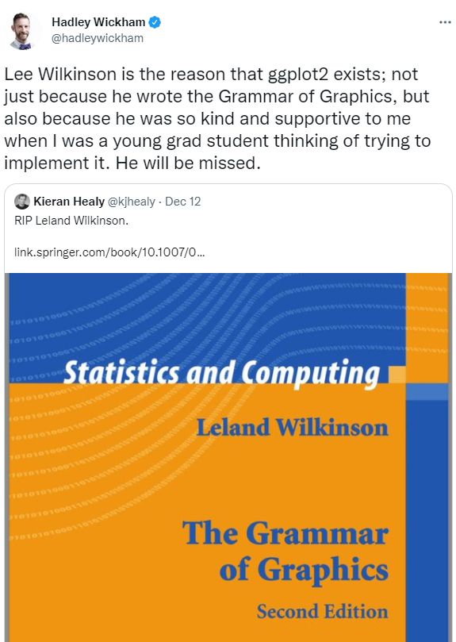
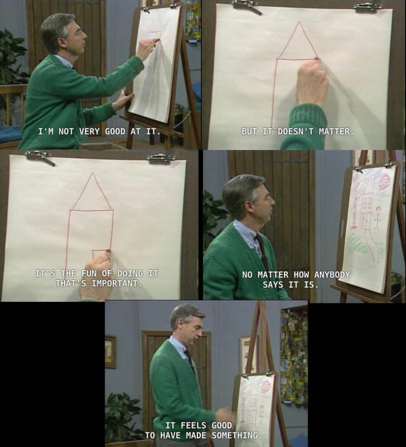

```{r setup, include = FALSE}

options(htmltools.dir.version = FALSE)

library(knitr)

opts_chunk$set(
  #prompt = T,
  fig.align="center", #fig.width=6, fig.height=4.5, 
  # out.width="748px", #out.length="520.75px",
  dpi=300, #fig.path='Figs/',
  cache=T#, echo=F, warning=F, message=F
  )

hook_source <- knitr::knit_hooks$get('source')
knitr::knit_hooks$set(source = function(x, options) {
  x <- stringr::str_replace(x, "^[[:blank:]]?([^*].+?)[[:blank:]]*#<<[[:blank:]]*$", "*\\1")
  hook_source(x, options)
})

```

```{css, echo=FALSE}
/* custom.css */
.left-code {
  color: #777;
  width: 40%;
  height: 92%;
  float: left;
}
.left-code-less {
  color: #777;
  width: 25%;
  height: 92%;
  float: left;
}
.right-plot {
  width: 58%;
  float: right;
  padding-left: 1%;
}
.right-plot-more {
  width: 65%;
  float: right;
  padding-left: 1%;
}
.plot-callout {
  height: 225px;
  width: 450px;
  bottom: 5%;
  right: 5%;
  position: absolute;
  padding: 0px;
  z-index: 100;
}
.plot-callout img {
  width: 100%;
  border: 4px solid #23373B;
}
```

# Outline
<br>
## [Introduction](#intro)

<br>
####Some musings from me about learning data vis in {ggplot2}.

--
<br>
## [We're going to build a plot.](#plot)

<br>
####It will be fun. 

---

class: inverse, center, middle
name: intro

# Introduction

<html><div style='float:left'></div><hr color='#EB811B' size=1px width=796px></html>

---

# What is ggplot2?

.pull-left[
+ The **gg** stands for the [**grammar of graphics**](https://link.springer.com/book/10.1007/0-387-28695-0).

+ **ggplot2** is an R package written by Hadley Wickham, and is an implementation of the book written by Leland Irving.

+ All the cool kids use it. 
]
--
.pull-right[

]
---

# Here's the grammar (in brief ...)

## 1. **Data** - without data, you don't have a plot!

---
count:false
# Here's the grammar (in brief ...)

#### 1. **Data** - without data, you don't have a plot!
## 2. <span style="color:#D24C39">**Mapping**</span> - linking variables to graphical properties.

---
count:false
# Here's the grammar (in brief ...)

#### 1. **Data** - without data, you don't have a plot!
#### 2. <span style="color:#D24C39">**Mapping**</span> - linking variables to graphical properties.
## 3. <span style="color:#268DC7">**Statistics**</span> - compute/transform numbers for us.

---
count:false
# Here's the grammar (in brief ...)

#### 1. **Data** - without data, you don't have a plot!
#### 2. <span style="color:#D24C39">**Mapping**</span> - linking variables to graphical properties.
#### 3. <span style="color:#268DC7">**Statistics**</span> - compute/transform numbers for us.
## 4. <span style="color:#F79A2F">**Scales**</span> - interpret values in data to graphical properties.

---
count:false
# Here's the grammar (in brief ...)

#### 1. **Data** - without data, you don't have a plot!
#### 2. <span style="color:#D24C39">**Mapping**</span> - linking variables to graphical properties.
#### 3. <span style="color:#268DC7">**Statistics**</span> - compute/transform numbers for us.
#### 4. <span style="color:#F79A2F">**Scales**</span> - interpret values in data to graphical properties.
## 5. <span style="color:#86B359">**Geometries**</span> - interpret aesthetics as graphical representations.

---
count:false
# Here's the grammar (in brief ...)

#### 1. **Data** - without data, you don't have a plot!
#### 2. <span style="color:#D24C39">**Mapping**</span> - linking variables to graphical properties.
#### 3. <span style="color:#268DC7">**Statistics**</span> - compute/transform numbers for us.
#### 4. <span style="color:#F79A2F">**Scales**</span> - interpret values in data to graphical properties.
#### 5. <span style="color:#86B359">**Geometries**</span> - interpret aesthetics as graphical representations.
## 6. <span style="color:#FFE784">**Facets**</span> - split plot into panels.

---
count:false
# Here's the grammar (in brief ...)

#### 1. **Data** - without data, you don't have a plot!
#### 2. <span style="color:#D24C39">**Mapping**</span> - linking variables to graphical properties.
#### 3. <span style="color:#268DC7">**Statistics**</span> - compute/transform numbers for us.
#### 4. <span style="color:#F79A2F">**Scales**</span> - interpret values in data to graphical properties.
#### 5. <span style="color:#86B359">**Geometries**</span> - interpret aesthetics as graphical representations.
#### 6. <span style="color:#FFE784">**Facets**</span> - split plot into panels.
## 7. <span style="color:#D03461">**Coordinates**</span> - define physical mapping.

---
count:false
# Here's the grammar (in brief ...)

#### 1. **Data** - without data, you don't have a plot!
#### 2. <span style="color:#D24C39">**Mapping**</span> - linking variables to graphical properties.
#### 3. <span style="color:#268DC7">**Statistics**</span> - compute/transform numbers for us.
#### 4. <span style="color:#F79A2F">**Scales**</span> - interpret values in data to graphical properties.
#### 5. <span style="color:#86B359">**Geometries**</span> - interpret aesthetics as graphical representations.
#### 6. <span style="color:#FFE784">**Facets**</span> - split plot into panels.
#### 7. <span style="color:#D03461">**Coordinates**</span> - define physical mapping.
## 8. <span style="color:#398E9A">**Theme**</span> - what does your plot look like?

---
count:false
# Here's the grammar (in brief ...)

#### 1. **Data** - without data, you don't have a plot!
####2. <span style="color:#D24C39">**Mapping**</span> - linking variables to graphical properties.
#### 3. <span style="color:#268DC7">**Statistics**</span> - compute/transform numbers for us.
#### 4. <span style="color:#F79A2F">**Scales**</span> - interpret values in data to graphical properties.
#### 5. <span style="color:#86B359">**Geometries**</span> - interpret aesthetics as graphical representations.
#### 6. <span style="color:#FFE784">**Facets**</span> - split plot into panels.
#### 7. <span style="color:#D03461">**Coordinates**</span> - define physical mapping.
#### 8. <span style="color:#398E9A">**Theme**</span> - what does your plot look like?

---
# My advice

### Find data you're interested in.

<br>
### Find code for plots you like, then experiment.

---
# My advice

### [You're going to suck.](https://www.youtube.com/watch?v=8SGif63VW6E&t=246s)

--
<br>
<div align="center">

</div>

---
class: inverse, center, middle
name: plot

# Let's plot. 

<html><div style='float:left'></div><hr color='#EB811B' size=1px width=796px></html>

---

# First, a wholesome meme.
<div align="center">


</div>
---

# Tidy Tuesday

### We'll need some data as a starting point. 

--

+ Let's use a dataset from the [Tidy Tuesday](https://github.com/rfordatascience/tidytuesday)

+ Remember, find something interesting to **you**!
--

+ I'm going to choose the data on [Ultra Trail Running](https://github.com/rfordatascience/tidytuesday/blob/master/data/2021/2021-10-26/readme.md)

---

# Obtain data

```{r, echo=TRUE, eval=TRUE, message=FALSE, include=TRUE}

library(tidytuesdayR)

# Obtain data
ultra_running <- tidytuesdayR::tt_load(x = 2021, week = 44) #<<

# It's a list object, with two elements: "ultra_rankings" and "race"
names(ultra_running)

# Pull those two elements out into separate objects
ultra_rankings <- ultra_running[["ultra_rankings"]]
race <- ultra_running[["race"]]

```

---

# What are our questions?

1. Which countries have the most ultra trail runners?

--

2. How has participation increased over time?

--

3. Have there been increases in female participation over time?

--

4. How does the gender pace gap decrease over distance?

---
count:false
# What are our questions?

1. **Which countries have the most ultra trail runners?**

<br>
<br>
### We're going to make the data simple for this session.

---

# A quick aside

### What is [**Tidy** data](https://r4ds.had.co.nz/tidy-data.html)? 

<br>
A few basic rules:
1. Each variable must have its own column.
2. Each observation must have its own row.
3. Each value must have its own cell. 

--

### ggplot2 is going to expect to be fed with tidy data.

---

# Top Countries

.code[
```{r, echo=TRUE, eval=TRUE, message=FALSE, include=TRUE}

# We'll use the dplyr package for some basic wrangling.
library(dplyr)

# Using the ultra_rankings dataframe
runners_per_nation <- ultra_rankings %>%
  # Only care about the runner and nationality columns
  select(runner, nationality) %>%
  # Obtain distinct combinations
  distinct() %>%
  # Count the number of runners from each country
  group_by(nationality) %>%
  tally(name = "number") %>%
  arrange(desc(number)) %>%
  ungroup()

```
]
---

# Top Countries

.pull-left[
```{r head, eval=FALSE}

head(runners_per_nation, n = 15) #<<

```
]

.pull-right[
```{r ref.label="head", echo=FALSE}

```

]

---

# First crack at it

.left-code[
```{r eval=FALSE}
library(ggplot2)

ggplot( #<<
  data = runners_per_nation,
  # geom_bar() requires both 
  # and y mapped
  mapping = aes(x = nationality, 
                y = number)) +
  # Raw counts
  geom_bar(stat = "identity")

```
]
---

# First crack at it

.left-code[
```{r eval=FALSE}
library(ggplot2)

ggplot(
  data = runners_per_nation, #<<
  # geom_bar() requires both 
  # and y mapped
  mapping = aes(x = nationality, 
                y = number)) +
  # Raw counts
  geom_bar(stat = "identity")

```
]

---

# First crack at it

.left-code[
```{r eval=FALSE}
library(ggplot2)

ggplot(
  data = runners_per_nation,
  # geom_bar() requires both 
  # and y mapped
  mapping = aes(x = nationality, #<<
                y = number)) +   #<<
  # Raw counts
  geom_bar(stat = "identity")

```
]

---

# First crack at it

.left-code[
```{r firstcrack, eval=FALSE}
library(ggplot2)

ggplot(
  data = runners_per_nation,
  # geom_bar() requires both 
  # and y mapped
  mapping = aes(x = nationality, 
                y = number)) +
  # Raw counts 
  geom_bar(stat = "identity") #<<

```
]

--
.right-plot[
```{r ref.label="firstcrack", echo=FALSE, fig.dim=c(4.8, 4.5), out.width="100%"}

```

]

---

# Global vs. geom-specific mapping

.left-code[
```{r secondcrack, eval=FALSE}
ggplot(
  data = runners_per_nation) +
  geom_bar(
    mapping = aes(
      x = nationality, #<<
      y = number),     #<<
    stat = "identity") 
```
]

.right-plot[
```{r ref.label="secondcrack", echo=FALSE, fig.dim=c(4.8, 4.5), out.width="100%"}

```

]

---

# Let's use geom_col() instead

.left-code[
```{r geomcol, eval=FALSE}
ggplot(
  data = runners_per_nation) +
  geom_col( #<<
    mapping = aes(
      x = nationality,
      y = number))
  # Shortcut 
```
]

.right-plot[
```{r ref.label="geomcol", echo=FALSE, fig.dim=c(4.8, 4.5), out.width="100%"}

```
]

---

# Let's look at the top 10

```{r, eval=TRUE}

top10 <- runners_per_nation %>%
  slice_max(number, n = 10)

# Aside: how many runners is this of the total? #<<

runners_per_nation %>%
  mutate(prop = round(prop.table(number), digits = 2)) %>%
  slice_max(number, n = 10) %>%
  summarise(prop_top_10 = sum(prop))

```

--
<br>

78% of the runners hail from the top 10 countries. 

---

# Let's look at the top 10

.left-code[
```{r top10, eval=FALSE}
ggplot(data = top10) + #<<
  geom_col( 
    mapping = aes(
      x = nationality,
      y = number))

# More informative!
```
]

.right-plot[
```{r ref.label="top10", echo=FALSE, fig.dim=c(4.8, 4.5), out.width="100%"}

```
]

---

# Order can be a visual aid

.left-code[
```{r ordered, eval=FALSE}
library(forcats) #<<

top10 <- top10 %>%
  mutate(
    nationality = fct_reorder( #<<
      nationality, #<<
      number, #<<
      .desc = TRUE #<<
    )
  )

ggplot(data = top10) +
  geom_col(
    mapping = aes(
      x = nationality,
      y = number))
```
]

.right-plot[
```{r ref.label="ordered", echo=FALSE, fig.dim=c(4.8, 4.5), out.width="100%"}

```
]

---

# Colour!

<br>
### Do we want to map a **specific property of the data** onto the *colour aesthetic*?

--

<br>
### Or, do we just want to add colour because we like it, not because the data dictates it?

--

<br>
### Both are valid!

---

# Colour aesthetic

.left-code[
```{r colaes, eval=FALSE}
ggplot(data = top10) +
  geom_col( 
    mapping = aes(
      x = nationality,
      y = number,
      # Within aes()
      # Simple expression
      colour = number > 10000)) #<<

```
]

--

.right-plot[
```{r ref.label="colaes", echo=FALSE, fig.dim=c(4.8, 4.5), out.width="100%"}

```
]

---

# Fill (sorry!) aesthetic

.left-code[
```{r fillaes, eval=FALSE}
ggplot(data = top10) +
  geom_col( 
    mapping = aes(
      x = nationality,
      y = number,
# We actually wanted fill 
# in this case
      fill = number > 10000)) #<<

```
]

--

.right-plot[
```{r ref.label="fillaes", echo=FALSE, fig.dim=c(4.8, 4.5), out.width="100%"}

```
]

---

# Fill aesthetic

.left-code[
```{r fillaesman, eval=FALSE}
ggplot(data = top10) +
  geom_col( 
    mapping = aes(
      x = nationality,
      y = number,
      fill = number > 10000)) +
  scale_fill_manual( #<<
    values = c("steelblue", #<<
               "darkred") #<<
  )

```
]

.right-plot[
```{r ref.label="fillaesman", echo=FALSE, fig.dim=c(4.8, 4.5), out.width="100%"}

```
]

---

# Fill aesthetic - continuous

.left-code[
```{r fillaescont, eval=FALSE}
ggplot(data = top10) +
  geom_col( 
    mapping = aes(
      x = nationality,
      y = number,
      fill = number)) #<<

```
]

--

.right-plot[
```{r ref.label="fillaescont", echo=FALSE, fig.dim=c(4.8, 4.5), out.width="100%"}

```
]

---

# Fill aesthetic - continuous

.left-code[
```{r fillaesgrad, eval=FALSE}
ggplot(data = top10) +
  geom_col( 
    mapping = aes(
      x = nationality,
      y = number,
      fill = number)) +
  scale_fill_gradient( #<<
    low = "#c6dbef", #<<
    high = "#08306b" #<<
  )
```
]

--

.right-plot[
```{r ref.label="fillaesgrad", echo=FALSE, fig.dim=c(4.8, 4.5), out.width="100%"}

```
]

---

# Fill aesthetic - continuous

.left-code[
```{r fillaesex, eval=FALSE}
ggplot(data = top10) +
  geom_col( 
    mapping = aes(
      x = nationality,
      y = number,
      fill = number)) +
  # More exotic
  scale_fill_viridis_c( #<<
    direction = -1 #<<
  )
```
]

--

.right-plot[
```{r ref.label="fillaesex", echo=FALSE, fig.dim=c(4.8, 4.5), out.width="100%"}

```
]

---

# Considerations

<br>
### Is this colour (fill) an effective visual aid?

<br>
### Is it communicating something important to the audience?

<br>
### Is there redundancy in the plot?

---

# Fill aesthetic - discrete

.left-code[
```{r fillaesdis, eval=FALSE}
ggplot(data = top10) +
  geom_col( 
    mapping = aes(
      x = nationality,
      y = number,
      # No longer continuous
      fill = nationality) #<<
  )
```
]

--

.right-plot[
```{r ref.label="fillaesdis", echo=FALSE, fig.dim=c(4.8, 4.5), out.width="100%"}

```
]

---

# Fill aesthetic - discrete

.left-code[
```{r disnoleg, eval=FALSE}
ggplot(data = top10) +
  geom_col( 
    mapping = aes(
      x = nationality,
      y = number,
      fill = nationality)) +
  theme(legend.position = "none") #<<
```
]

.right-plot[
```{r ref.label="disnoleg", echo=FALSE, fig.dim=c(4.8, 4.5), out.width="100%"}

```
]

---

# Fill aesthetic - discrete

.left-code[
```{r brewer, eval=FALSE}
library(RColorBrewer)

ggplot(
  filter(top10, 
         number < 10000)) +
  geom_col( 
    mapping = aes(
      x = nationality,
      y = number,
      fill = nationality)) +
  scale_fill_brewer( #<<
    palette = "Dark2") + #<<
  theme(legend.position = "none")
```
]

.right-plot[
```{r ref.label="brewer", echo=FALSE, fig.dim=c(4.8, 4.5), out.width="100%"}

```
]

---

# Single (fill) colour

.left-code[
```{r single, eval=FALSE}
ggplot(data = top10) +
  geom_col( 
    mapping = aes(
      x = nationality,
      y = number,
      fill = "steelblue")) #<<
```
]

--

.right-plot[
```{r ref.label="single", echo=FALSE, fig.dim=c(4.8, 4.5), out.width="100%"}

```
]

--

**Crap.**

---

# Single (fill) colour - not related to data

.left-code[
```{r sb, eval=FALSE}
ggplot(data = top10) +
  geom_col( 
    mapping = aes(
      x = nationality,
      y = number), #<<
      fill = "steelblue") #<<
# No legend in this case.

# Nothing to communicate
# about the fill.
```
]

.right-plot[
```{r ref.label="sb", echo=FALSE, fig.dim=c(4.8, 4.5), out.width="100%"}

```
]

---

# Part 2

OK, we have the basics of the plot. What else can we do?

--

Here are some ideas to run through:

+ Flip coordinates
+ Re-jig the axis labels and text
+ Add a title, maybe a caption
+ Explore different themes
+ Use more informative colours to tell a story
+ Add text labels
+ Improve various aesthetics

---

# Better labeling

```{r, eval=TRUE}
library(countrycode)

top10 <- top10 %>%
  mutate(full_nm = countrycode(nationality,
                               origin = "iso3c",
                               destination = "country.name"),
         full_nm = fct_reorder(full_nm,
                               number,
                               .desc = FALSE))

head(top10)

```

---

# Base plot

.left-code[
```{r start, eval=FALSE}
plot1 <- ggplot(data = top10) +
  geom_col( 
    mapping = aes(
      x = full_nm, #<<
      y = number))

plot1
```
]

--

.right-plot[
```{r ref.label="start", echo=FALSE, fig.dim=c(4.8, 4.5), out.width="100%"}

```
]

---

# Flip coordinates

.left-code[
```{r coordflip, eval=FALSE}
plot1 +
  coord_flip()
```
]

.right-plot[
```{r ref.label="coordflip", echo=FALSE, fig.dim=c(4.8, 4.5), out.width="100%"}

```
]

---

# Add title(s), remove axis labels

.left-code[
```{r coordflipaxis, eval=FALSE}
plot1 +
  coord_flip() +
  labs( #<<
    title = "Top 10 countries with most ultra runners", #<<
    subtitle = "In races held between 2012-2021.") + #<<
  scale_y_continuous( #<<
    labels = scales::comma) + #<<
  theme( #<<
    axis.title.x = element_blank(), #<<
    axis.title.y = element_blank()) #<<
```
]

.right-plot[
```{r ref.label="coordflipaxis", echo=FALSE, fig.dim=c(4.8, 4.5), out.width="100%"}

```
]

---

# Informative (fill) colours

```{r europe, eval=TRUE}
library(stringr)

# Maybe we want to highlight certain countries.
top10 <- top10 %>%
  mutate(group = case_when(
    str_detect(nationality, "FRA|GBR|ESP|ITA|POL") ~ "Europe",
    nationality == "CAN" ~ "Canada",
    TRUE ~ "Other"
  ))

# New base plot ...
plot2 <- ggplot(top10) +
  geom_col(aes(x = full_nm, y = number, fill = group)) + #<<
  coord_flip() +
  labs(title = "Top 10 countries with most ultra runners",
       subtitle = "In races held between 2012-2021.") + 
  scale_y_continuous(labels = scales::comma)

```

---

# Informative (fill) colours

.left-code[
```{r group, eval=FALSE}
plot2 + 
  scale_fill_manual( #<<
    values = c( #<<
      "Europe" = "steelblue", #<<
      "Canada" = "#FF0000", #<<
      "Other" = "grey60"), #<<
    name = NULL) + #<<
  theme(
    legend.position = "bottom", #<<
    axis.title = element_blank() #<<
  )
```
]

.right-plot[
```{r ref.label="group", echo=FALSE, fig.dim=c(4.8, 4.5), out.width="100%"}

```
]

---

# We can do better than a legend.

```{r}

# Let's write some cool text.
library(ggtext)

# About what?
top10 %>%
  group_by(group) %>%
  summarise(total_runners = sum(number)) %>%
  mutate(prop = prop.table(total_runners))

cool_text <- '<span style="color:#4682b4;">**European**</span> countries<br>account for 49.8% of all runners<br>among the top 10 countries.<br><br>There have been<br>1,427 ultra runners from <span style="color:#FF0000;">**Canada**</span>.'

```

---

# We can do better than a legend.

.left-code[
```{r text, eval=FALSE}
plot2 + 
  annotate( #<<
    geom = "richtext",#<<
    x = 6, y = 14500,#<<
    label = cool_text,#<<
    label.colour = NA, fill = NA,#<<
    fontface = "bold",#<< 
    color = "grey20",#<<
    size = 3.5#<<
  ) +
  scale_fill_manual(
    values = c( 
      "Europe" = "steelblue",
      "Canada" = "#FF0000",
      "Other" = "grey60"),
    name = NULL) +
  theme_minimal() +#<<
  theme(
    legend.position = "none", #<<
    axis.title = element_blank())
```
]

.right-plot[
```{r ref.label="text", echo=FALSE, fig.dim=c(4.8, 4.5), out.width="100%"}

```
]

---

# Let's try text labels.

```{r}
# Going to re-do the whole plot ... getting complicated!!
plot1 <- ggplot(top10) +
  geom_col(aes(x = full_nm, y = number, fill = group)) +
  geom_text(aes(y = number + 1000, x = full_nm, colour = group,#<<
                label = scales::comma(number)), size = 3) +#<<
  annotate(geom = "richtext", x = 6, y = 14500, label = cool_text, label.colour = NA, 
           fill = NA, fontface = "bold", color = "grey20", size = 3.5) +
  labs(title = "Top 10 countries with most ultra runners",
       subtitle = "In races held between 2012-2021.") + 
  scale_y_continuous(expand = c(0, 150)) +#<<
  scale_fill_manual(values = c("Europe" = "steelblue", "Canada" = "#FF0000",
                               "Other" = "grey50"), name = NULL) +
  scale_color_manual(values = c("Europe" = "steelblue", "Canada" = "#FF0000",
                                "Other" = "grey50"), name = NULL) +
  coord_flip() +
  theme_classic() +
  theme(axis.title = element_blank(),
        axis.text.x = element_blank(), axis.text.y = element_text(face = "bold"),
        legend.position = "none",
        panel.grid = element_blank(), #<<
        axis.ticks = element_blank(), axis.line = element_blank()) #<<
```

---

# The product

.left-code-less[
```{r third, eval=FALSE}
plot1
```
]

.right-plot-more[
```{r ref.label="third", echo=FALSE, fig.dim=c(5.3, 4.97), out.width="100%"}

```

]

---

# Final options

.left-code[
```{r font1, eval = FALSE}
# Let's change the fonts and add a caption
# sysfonts::font_add_google("Montserrat")
showtext::showtext_auto()

plot1 +
  labs(#<<
    caption = "Data from #TidyTuesday project. Plot by M.Becker.") +#<<
  theme(#<<
    text = element_text(
      family = "Montserrat"))#<<
```
]

.right-plot[
```{r ref.label="font1", echo=FALSE, fig.dim=c(4.8, 4.5), out.width="100%", fig.showtext=TRUE, warning=FALSE}

```

]

---

# gg after dark

```{r}
library(ggdark)
last_plot1 <- ggplot(top10) +
  geom_col(aes(x = full_nm, y = number, fill = group)) +
  geom_text(aes(y = number + 1000, x = full_nm, label = scales::comma(number)), 
            size = 3, family = "Montserrat", color = "white") +#<<
  annotate(geom = "richtext", x = 6, y = 14500, label = cool_text, label.colour = NA, 
           fill = NA, fontface = "bold", color = "white", size = 3.5, #<<
           family = "Montserrat") #<<

```

---

# gg after dark

```{r, warning=FALSE}

last_plot2 <- last_plot1 +
  labs(title = "Top 10 countries with most ultra runners",
       subtitle = "In races held between 2012-2021.",
       caption = "Data from #TidyTuesday project. Plot by M.Becker.") +#<< 
  scale_y_continuous(expand = c(0, 150)) +
  scale_fill_manual(values = c("Europe" = "steelblue", "Canada" = "#FF0000",
                               "Other" = "grey50"), name = NULL) +
  scale_color_manual(values = c("Europe" = "steelblue", "Canada" = "#FF0000",
                                "Other" = "grey50"), name = NULL) +
  coord_flip() +
  dark_theme_classic() +#<<
  theme(axis.title = element_blank(),
        axis.text.x = element_blank(), axis.text.y = element_text(face = "bold"),
        legend.position = "none",
        panel.grid = element_blank(),
        axis.ticks = element_blank(), axis.line = element_blank(),
        text = element_text(family = "Montserrat", color = "white")) #<<
```

---

# gg after dark

.left-code-less[
```{r dark, eval = FALSE}
last_plot2
```
]

.right-plot-more[
```{r ref.label="dark", echo=FALSE, fig.dim=c(5.3, 4.97), out.width="100%", fig.showtext=TRUE, warning=FALSE}

```

]

